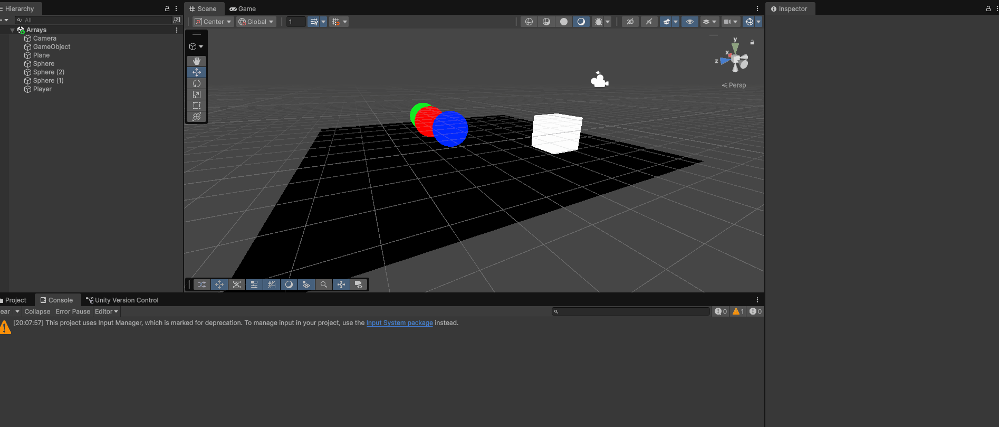

# Unity_M2

Peggle idee.

Eerste idee was een peggle game met de style can elden ring maar dat was niet gelukt doordat ik wist niet hoe ik kan een schieter met een stijl van elden ring doen en dus heb ik bedacht een peggle game met de style van pool of billiards.

dus de schieter is een pool stok en elke bal geeft een verschillende multiplier en aantal punten en de zwarte 8 bal geeft het meest tuurlijk maar het heeft de andere ballen omheen het zodat er obstakles er zijn.

GD - M2 - GDV: Opdracht 1A: Array

